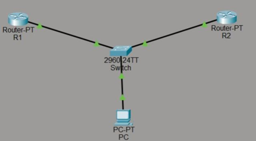

# Gateway Backup using HSRP


> A gateway redundancy and failover system using HSRP (Hot Standby Router Protocol) implemented on dual Cisco routers. The project ensures uninterrupted network connectivity by automatically switching traffic to a standby router when the active router fails.

---

# Table of Contents

- How It Works
- Network Topology
- Router Configuration
- Failover Testing
- Packet Flow
- Components Used
- Commands Used
- Results
- Future Scope

---

# ⚙️ How It Works

The project uses two Cisco routers configured in the same HSRP group to provide gateway redundancy. One router operates as the **Active Router**, while the second router remains in **Standby Mode**. Both routers share a common **Virtual IP Address** that acts as the default gateway for all client devices.

If the active router fails, the standby router automatically takes over forwarding operations with minimal downtime.

<p align="center">
<b> HSRP Network Topology </b>

</p>

---

## Step-by-step Flow

### 1. System Initialization

When the network starts, both routers initialize their interfaces and establish HSRP communication. A virtual IP address is configured and the router with the highest priority becomes the Active Router.

The PC uses the virtual IP as its default gateway.

---

### 2. Active and Standby Election

HSRP uses router priorities to determine router roles.

| Router | Priority | State |
|---|---|---|
| R1 | 110 | Active |
| R2 | 100 | Standby |

The router with the highest priority becomes the Active Router while the second router remains in Standby mode.

---

### 3. Virtual Gateway Operation

Both routers share:

- One Virtual IP Address
- One Virtual MAC Address

End devices communicate only with the virtual gateway and remain unaware of physical router changes during failover.

---

### 4. HSRP Hello Communication

Routers continuously exchange HSRP hello packets to maintain synchronization.

| Parameter | Value |
|---|---|
| Protocol | UDP |
| Port | 1985 |
| Multicast Address | 224.0.0.2 |

These packets are used to monitor router availability.

---

### 5. Failure Detection

When the Active Router interface is manually shut down:

- Hello packets stop
- Standby router detects failure
- Standby router changes to Active state

---

### 6. Automatic Failover

The Standby Router automatically takes over the virtual gateway role.

During failover:

- Only 3 ping packets are lost
- Connectivity resumes automatically
- No manual configuration is required

---

### 7. Preemption Recovery

When the original Active Router comes back online:

- HSRP checks router priorities
- Higher priority router regains Active role
- Other router returns to Standby state

This occurs because preemption is enabled.

---

#  Network Topology

The topology consists of:

- Two Cisco Routers
- One Switch
- One PC
- Shared HSRP Virtual Gateway

<p align="center">
<b> Network Topology </b>

</p>

---

#  IP Addressing

| Device | IP Address |
|---|---|
| Router R1 | 192.168.1.1 |
| Router R2 | 192.168.1.2 |
| Virtual IP | 192.168.1.100 |
| PC | 192.168.1.10 |

---

#  Router Configuration

## Router R1 Configuration

```bash
enable
configure terminal

interface fastethernet0/0
ip address 192.168.1.1 255.255.255.0

standby 1 ip 192.168.1.100
standby 1 priority 110
standby 1 preempt

no shutdown
exit
```

---

## Router R2 Configuration

```bash
enable
configure terminal

interface fastethernet0/0
ip address 192.168.1.2 255.255.255.0

standby 1 ip 192.168.1.100
standby 1 priority 100
standby 1 preempt

no shutdown
exit
```

---

#  PC Configuration

| Parameter | Value |
|---|---|
| IP Address | 192.168.1.10 |
| Subnet Mask | 255.255.255.0 |
| Default Gateway | 192.168.1.100 |

---

#  Failover Testing

Continuous ping testing is performed from the PC to the virtual gateway.

```bash
ping 192.168.1.100 -t
```

---

## Before Failure

- R1 operates as Active Router
- R2 remains Standby
- Continuous ping replies received successfully

<p align="center">
<b> Active Router Status </b>

</p>

---

## Simulating Failure

The Active Router interface is shut down manually.

```bash
interface fastethernet0/0
shutdown
```

<p align="center">
<b> Router Failure Simulation </b>

</p>

---

## After Failover

- R2 becomes Active Router
- Connectivity restores automatically
- Minimal packet loss observed

<p align="center">
<b> Failover Result </b>

</p>

---

# 📨 Packet Flow Analysis

HSRP routers exchange hello packets periodically to maintain redundancy.

<p align="center">
<b> HSRP Packet Flow </b>

</p>

The simulation verified:

- UDP Port 1985 communication
- Multicast packet exchange
- Successful Active/Standby synchronization

---

# 🛠 Components Used

| # | Component | Purpose |
|---|---|---|
| 1 | Cisco Router | HSRP configuration |
| 2 | Cisco Switch | LAN connectivity |
| 3 | PC | Connectivity testing |
| 4 | Cisco Packet Tracer | Network simulation |
| 5 | Ping Utility | Failover verification |

---

#  Commands Used

| Command | Purpose |
|---|---|
| `standby 1 ip` | Configure virtual IP |
| `standby 1 priority` | Set router priority |
| `standby 1 preempt` | Enable preemption |
| `show standby` | Display HSRP status |
| `shutdown` | Simulate failure |
| `ping` | Test connectivity |

---

#  Results

The project successfully demonstrated HSRP gateway redundancy.

### Observations

- R1 initially worked as Active Router
- R2 remained in Standby mode
- Automatic failover occurred after R1 shutdown
- Connectivity restored automatically
- Only 3 ping packets were lost

---

## Test Results

| Test Case | Result |
|---|---|
| Initial HSRP setup | Successful |
| Active Router election | Successful |
| Standby Router detection | Successful |
| Router failure simulation | Successful |
| Automatic failover | Successful |
| Connectivity recovery | Successful |
| Packet loss during failover | Minimal |

---

#  Advantages

- High Availability
- Automatic Failover
- Fault Tolerance
- Reduced Downtime
- Reliable Gateway Redundancy
- Improved Network Reliability

---

#  Limitations

- Cisco proprietary protocol
- Requires multiple routers
- Increased infrastructure cost
- Additional protocol overhead
- More complex configuration

---

#  Future Scope

- Implement VRRP
- Implement GLBP
- Add Load Balancing
- Integrate OSPF/EIGRP
- Add ACL Security
- Deploy on Real Cisco Hardware

---

#  Applications

- Enterprise Networks
- Data Centers
- Banking Infrastructure
- Campus Networks
- ISP Networks
- Mission-Critical Systems

---

# Conclusion

The project successfully demonstrated the implementation of HSRP for gateway redundancy and failover protection using Cisco routers.

By configuring two routers with a shared virtual gateway, uninterrupted connectivity was maintained even after failure of the primary router. The project proved that HSRP significantly improves network reliability, fault tolerance, and availability with minimal downtime.

---

# References

1. Cisco HSRP Documentation  
2. Cisco Packet Tracer  
3. Computer Communication Networks Lab Manual  
4. Cisco Networking Academy

